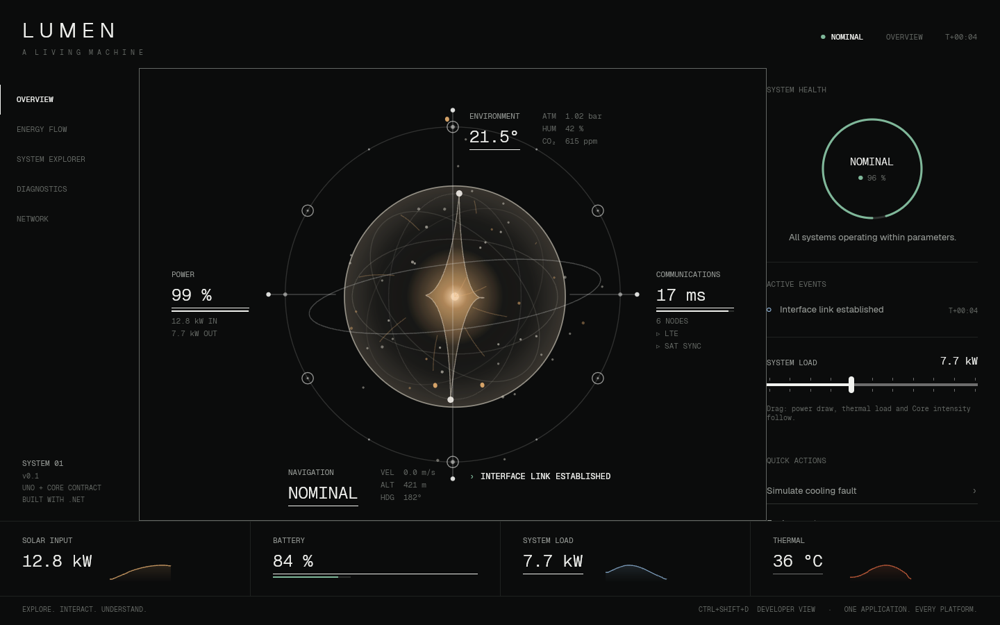

# LUMEN — a living machine

Uno Platform showcase from the spec kit in [`spec-kit/`](spec-kit/README.md). Implementation decisions and briefs are in [`docs/IMPLEMENTATION_SPEC.md`](docs/IMPLEMENTATION_SPEC.md); acceptance status is in [`docs/ACCEPTANCE_STATUS.md`](docs/ACCEPTANCE_STATUS.md).

**Core rule: Uno owns truth. The Core presenter expresses truth.**


## Solution

| Project | Target | Contents |
|---|---|---|
| `Lumen.Core` | `net10.0` | Domain, deterministic causal simulator, state classifier, cooling-fault scenario (loads the spec-kit fixture), presenter contract, pointer field, press gesture, first-run timeline, onboarding coach |
| `Lumen` | Uno single project (desktop, wasm, android, ios) | Shell, five experiences, Rive and procedural Core presenters, controls, styles |
| `Lumen.Rive` | `net10.0` | SkiaSharp bridge + `RiveScene` over the native Rive runtime (`native/lumen-rive`) |
| `Lumen.Tests` | `net10.0`, xUnit v3 | 59 tests: domain/simulator, plus `lumen-core.riv` rendered headlessly through the native runtime (skipped where it isn't built) |

## Build, test, run

```powershell
# Native Rive runtime (optional; without it the procedural Core is used)
native/lumen-rive/build.sh            # Linux/macOS  (Windows: native/lumen-rive/build.ps1)

# Tests (Microsoft.Testing.Platform runner, configured in global.json)
dotnet test --project Lumen.Tests

# Desktop head only (skips android/ios workloads)
dotnet build Lumen/Lumen.csproj -p:LumenTfm=net10.0-desktop
dotnet run --project Lumen/Lumen.csproj -p:LumenTfm=net10.0-desktop

# WebAssembly head (needs: dotnet workload install wasm-tools)
dotnet build Lumen/Lumen.csproj -p:LumenTfm=net10.0-browserwasm
```

Opening `Lumen.sln` in Visual Studio / Rider builds every head listed in `Lumen.csproj`; android/ios need their workloads (`uno-check`).

`LUMEN_WINDOW=390x844` sets the desktop window size at launch, which is handy for checking the mobile composition. Debug builds call `UseStudio()`; launch through the IDE/DevServer, or use a Release build for a bare `dotnet run`.

## Using it

| Input | Effect |
|---|---|
| Pointer near the Core | Particles bias, geometry turns, membrane reaches toward the pointer |
| Press / hold / release the Core (or Space) | Contact → charge (800 ms) → radial pulse that continues through the Uno readouts, nearest first |
| Double-click the Core, `E`, or *Explore system* | Explode into six subsystems; click a node (or arrows + Enter) to open the inspector |
| `Esc` | Close inspector, then collapse |
| Diagnostics → *Run cooling pump degradation* | 45 s fixture scenario: Nominal → Elevated → Degraded → Recovering → Nominal |
| `Ctrl+Shift+D` | Developer view: Core-presenter vs Uno regions and the live C# → Core bindings |

## Architecture in one picture

```text
TelemetryHost (100 ms fixed steps)
  └─ LumenSystem.Tick → FaultScenarioService → TelemetrySimulator → SystemStateClassifier
       └─ ShellViewModel.ApplyTelemetry (XAML bindings, 10 Hz)
            └─ VisualStateMapper → ILumenCorePresenter.Apply (normalized inputs)

CoreStage (pointer, touch, keys, tilt) ──► ILumenCorePresenter.SetInteraction   (no XAML layout work)
CoreStage press events + presenter milestones ──► RiveEventAdapter ──► ILumenCommands (ShellViewModel)
```

## About Rive

`Lumen/Assets/Rive/lumen-core.riv` implements the `LumenCore` contract: artboard, state machine, all spec inputs, triggers and events. It is generated by `tools/rive/build_lumen_core.py` and verified in the official Rive web runtime (14/14 checks); see [`tools/rive/README.md`](tools/rive/README.md).


**The app plays it through the native Rive runtime** when `liblumen_rive` is built for the platform. The Core then renders with SkiaSharp on the same canvas as the XAML ([`native/lumen-rive`](native/lumen-rive/README.md)). Otherwise it falls back to the procedural renderer (`Lumen/Rive/LumenCoreRenderer.cs`), which implements the same contract. `LUMEN_CORE=procedural` forces the fallback. Developer view (Ctrl+Shift+D) shows the active engine.



Status: Linux desktop is verified. Windows and macOS have build scripts. Android, iOS and WebAssembly are not started. In Rive mode, Energy Flow and Network show the Core without their overlays, and the Explorer focus offset isn't in the file yet.

Contract extensions (flagged `*` in developer view): `stressedSubsystem` (in the `.riv`), `pressed` (in the `.riv`, set by its own listeners), and `netFlow` (stand-in only; Energy Flow stays in Uno/Skia).

## Credits

Geist and Geist Mono © Vercel, SIL Open Font License 1.1 (`Lumen/Assets/Fonts/OFL-Geist.txt`).
