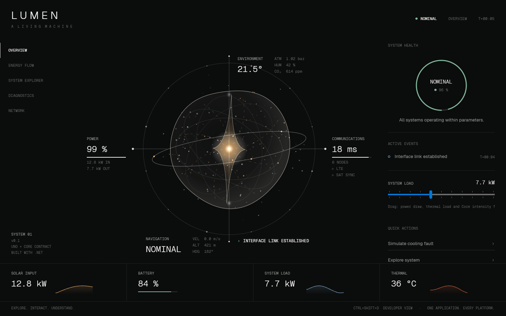

# LUMEN — a living machine

Uno Platform showcase from the spec kit in [`spec-kit/`](spec-kit/README.md). Implementation decisions and briefs are in [`docs/IMPLEMENTATION_SPEC.md`](docs/IMPLEMENTATION_SPEC.md); acceptance status is in [`docs/ACCEPTANCE_STATUS.md`](docs/ACCEPTANCE_STATUS.md).

**Core rule: Uno owns truth. The Core presenter expresses truth.**



## Solution

| Project | Target | Contents |
|---|---|---|
| `Lumen.Core` | `net10.0` | Domain, deterministic causal simulator, state classifier, cooling-fault scenario (loads the spec-kit fixture), presenter contract, pointer field, press gesture, first-run timeline, onboarding coach |
| `Lumen` | Uno single project (desktop, wasm, android, ios) | Shell, five experiences, procedural Core presenter, controls, styles |
| `Lumen.Tests` | `net10.0`, xUnit v3 | 52 tests over `Lumen.Core`; no UI or Rive needed |

## Build, test, run

```powershell
# Tests (Microsoft.Testing.Platform runner, configured in global.json)
dotnet test --project Lumen.Tests

# Desktop head only (skips android/ios workloads)
dotnet build Lumen/Lumen.csproj -p:LumenTfm=net10.0-desktop
dotnet run --project Lumen/Lumen.csproj -p:LumenTfm=net10.0-desktop

# WebAssembly head (needs: dotnet workload install wasm-tools)
dotnet build Lumen/Lumen.csproj -p:LumenTfm=net10.0-browserwasm
```

Opening `Lumen.sln` in Visual Studio / Rider builds every head listed in `Lumen.csproj`; android/ios need their workloads (`uno-check`).

`LUMEN_WINDOW=390x844` sets the desktop window size at launch, which is handy for checking the mobile composition. Debug builds call `UseStudio()`; launch through the IDE/DevServer, or use a Release build for a bare `dotnet run`.

## Using it

| Input | Effect |
|---|---|
| Pointer near the Core | Particles bias, geometry turns, membrane reaches toward the pointer |
| Press / hold / release the Core (or Space) | Contact → charge (800 ms) → radial pulse that continues through the Uno readouts, nearest first |
| Double-click the Core, `E`, or *Explore system* | Explode into six subsystems; click a node (or arrows + Enter) to open the inspector |
| `Esc` | Close inspector, then collapse |
| Diagnostics → *Run cooling pump degradation* | 45 s fixture scenario: Nominal → Elevated → Degraded → Recovering → Nominal |
| `Ctrl+Shift+D` | Developer view: Core-presenter vs Uno regions and the live C# → Core bindings |

## Architecture in one picture

```text
TelemetryHost (100 ms fixed steps)
  └─ LumenSystem.Tick → FaultScenarioService → TelemetrySimulator → SystemStateClassifier
       └─ ShellViewModel.ApplyTelemetry (XAML bindings, 10 Hz)
            └─ VisualStateMapper → ILumenCorePresenter.Apply (normalized inputs)

CoreStage (pointer, touch, keys, tilt) ──► ILumenCorePresenter.SetInteraction   (no XAML layout work)
CoreStage press events + presenter milestones ──► RiveEventAdapter ──► ILumenCommands (ShellViewModel)
```

## About Rive

There is no `lumen-core.riv` yet, and the only public .NET Rive runtime (`Rive.RiveSharp 1.0.5-alpha`, 2022) ships Windows-only native binaries against SkiaSharp 2.88, while Uno.Sdk 6.7 uses SkiaSharp 3.119. The Core is therefore drawn by `Lumen/Rive/LumenCoreRenderer.cs`, a procedural SkiaSharp stand-in that implements the exact `LumenCore` contract from `spec-kit/rive/RIVE_CORE_SPEC.md`.

To switch to Rive:
1. Author `Assets/Rive/lumen-core.riv` with the `LumenCore` state machine, inputs, triggers and events from the spec.
2. Replace `LumenCoreRenderer` + `LumenCoreCanvas` with a Rive view, and map `Apply`/`Trigger`/`SetInteraction` to state-machine inputs inside `LumenCorePresenter`.
3. Forward Rive events to `EventRaised`. `RiveEventAdapter`, the view model and all tests stay unchanged.

Contract extensions the stand-in uses (flagged `*` in developer view): `netFlow` (-1..1) for Energy Flow direction and `stressedSubsystem` for localized instability.

## Credits

Geist and Geist Mono © Vercel, SIL Open Font License 1.1 (`Lumen/Assets/Fonts/OFL-Geist.txt`).
