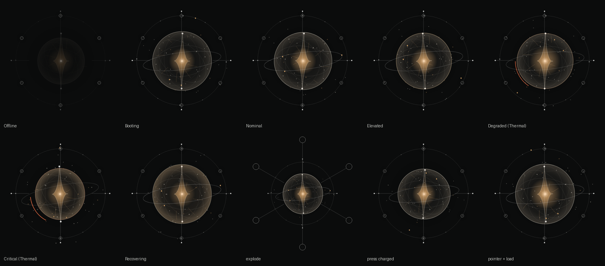

# lumen-core.riv

`Lumen/Assets/Rive/lumen-core.riv` is generated by code, not exported from the Rive editor.

- `build_lumen_core.py` builds the artboard, animations and `LumenCore` state machine from `spec-kit/rive/RIVE_CORE_SPEC.md`.
- `riv_writer.py` is a minimal writer for the Rive runtime binary format (major 7, minor 4).
- `rive_schema.json` holds the type keys, property keys and field types. It was extracted from the generated headers of [rive-app/rive-runtime](https://github.com/rive-app/rive-runtime) (`include/rive/generated/**/*_base.hpp`).

```powershell
python tools/rive/build_lumen_core.py           # regenerate the .riv
cd tools/rive/verify; npm install; node verify.mjs   # check it in the official Rive web runtime
```

`verify.mjs` loads the file with `@rive-app/canvas` 2.43.1 in headless Chromium. It checks that the file loads without import errors and that every contract input exists. It also checks that Nominal never freezes, that every trigger and pointer gesture produces its event, and that the continuous inputs change the render. It writes screenshots to `verify/shots/`. Current result: **14/14**.



## Contract

**Artboard `LumenCore`** (500×500) has this hierarchy: `Core / Gravity / Compress / PressCompress / Instability / {Membrane, InternalGeometry, Nucleus, Orbitals, FlowNetwork, InteractionField/Particles, StateEffects}`. `Reticle` and `Subsystems/{Power, Environment, Thermal, Navigation, Communications, Compute}` sit alongside.

**State machine `LumenCore`** has these inputs, in this order:

| Input | Type | Notes |
|---|---|---|
| `systemState` | number | 0 Offline, 1 Booting, 2 Nominal, 3 Elevated, 4 Degraded, 5 Critical, 6 Recovering (same order as `SystemState`) |
| `health` `power` `temperature` `load` `latency` | number 0..1 | 1D blends |
| `pointerX` `pointerY` `gravityX` `gravityY` | number -1..1 | 1D blends |
| `pointerDistance` `interactionForce` | number 0..1 | 1D blends |
| `wake` `pulse` `fault` `recover` `explode` `collapse` `inspect` `acknowledge` | trigger | |
| `pressed` | bool | extension: set by the Core hit-area listeners |
| `stressedSubsystem` | number -1..5 | extension: localized instability, `SubsystemId` order, -1 = none |

**Events:**

| Event | Source |
|---|---|
| `CorePressed`, `CoreReleased` | pointer listeners on the Core |
| `CoreCharged` | press layer, 250 ms contact + 550 ms charge |
| `PulseCompleted`, `RecoveryVisualCompleted` | end of the pulse / recover one-shots |
| `ExplodeCompleted`, `CollapseCompleted` | mode layer |
| `SubsystemSelected` | pointer down on a node; custom number property `id` = `SubsystemId` |

**Layers:**

- `SystemState` holds the seven poses, with 800 ms blended transitions. It never decides state.
- `Breath`, `Drift`, `Orbit` and `Spin` are independent loops with mismatched periods: 4.3, 5.7, 6.9 and 24 s.
- `Heartbeat` is calm, fast (Elevated and Degraded) or irregular (Critical).
- One blend layer per numeric input.
- `Triggers`, `Press` and `Mode`.

C# still owns every threshold. The file only expresses the state it is given.

## Limits
- It is procedural geometry (ellipses, star path, particles). A motion designer can open it in the Rive editor (*Import → .riv*) to refine it, but the editor's own `.rev` source is not produced here.
- Energy Flow and Network visuals are not in this file. They stay in the Uno/Skia presenter.
